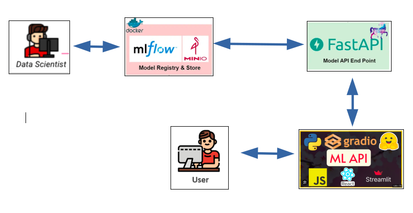

# Mlops-Project
Setting up an architecture for experimentation and deployment of machine learning models.
## Architecture
This comprehensive architecture creates a smooth and automated process for deploying, managing, and updating machine learning models.



## Guide d'utilisation du Projet MLOps

This guide details the steps to configure, train, and deploy models with the MLOps project. Check the video demo below for a visual presentation of the main steps.

[](lien-vers-la-video)


## Étapes préliminaires

### 1. Connexion à l'instance EC2

Connect to your EC2 instance.

### 2. Clone the Repository and Set up the Environment
Clone the MLOps repository using the following command:

```
git clone https://github.com/Mohamedabdelli/Projet-MLflow-minio-FastApi.git

```

## Environment Configuration


### 3. Create the .env File in the MLOps Repository
Create a `.env`file in the MLOps project directory with the following content:


```
AWS_ACCESS_KEY_ID="projet_mlops"
AWS_SECRET_ACCESS_KEY="projet_mlops"
AWS_DEFAULT_REGION="us-east-1"
POSTGRES_USER_mlflow=mlflow
POSTGRES_PASSWORD_mlflow=mlflow
POSTGRES_DB_mlflow=mlflow
JUPYTER_TOKEN="projet_mlops"
```
## Deployment Commands
### 4. Launch Docker Services in the MLOps Repository
Start Docker services using the following command:

```
cd Mlops
docker-compose up -d

```
Access MLflow at your instance's IP address on port 5000 and Minio on port 9000.

## Entraînement et déploiement des modèles

Run the `export.sh` script to train the project in the [MLflow-projet](https://github.com/Mohamedabdelli/projet-mlflow.git). The model will be trained locally, then uploaded to MLflow and stored in Minio. You can upload multiple models by modifying hyperparameters. For more details on the structure of an MLflow project, see [This link](https://mlflow.org/docs/2.4.2/projects.html).


Command:

```
sh export.sh
```


## Model Comparison and Deployment
Compare models in the MLflow interface and choose the one you want to deploy in production.

Test the model from the notebook. Execute the notebook cells to use the model based on an 'id' or the model in production.
### FastAPI
Create a  `.env`  file for FastAPI in the Test_FastApi repository with the following content:

```
AWS_ACCESS_KEY_ID="projet_mlops"
AWS_SECRET_ACCESS_KEY="projet_mlops"
AWS_DEFAULT_REGION="us-east-1"
MLFLOW_S3_ENDPOINT_URL="http://your-instance-ip:9000"
MLFLOW_TRACKING_URI="http://your-instance-ip:5000"

```
Replace `your-instance-ip` with the IP address of the instance where MLflow and Minio are installed.

FastAPI points to the model in production at http://your-instance-ip:5400.

## Learn More
For a more detailed description of each step and advanced features, consult the PDF document. [Guide_MLOps.pdf](lien-vers-le-pdf).
